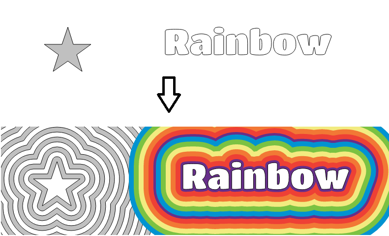

# svg-path-outline

Create an outline surrounding an SVG path



A stroke is typically used to outline an SVG element. Use this package if you need an actual SVG path instead. When corners are outlined, you have the option of specifying the style of joint: round, square, or beveled. 

Live demo: https://danmarshall.github.io/svg-path-outline/browser

## Installation

### Node

```
npm install svg-path-outline --save
```

### Browser

```html
<script src="https://pomax.github.io/bezierjs/bezier.js" type="text/javascript"></script>
<script src="https://microsoft.github.io/maker.js/target/js/browser.maker.js" type="text/javascript"></script>
<script src="https://danmarshall.github.io/svg-path-outline/browser/index.js" type="text/javascript"></script>
```

## Usage

```js
var spo = require('svg-path-outline');

var outline = spo(svgData, distance, options);
```

## Parameters

### svgData

Input is a string of either SVG `path` data, or point coordinates from SVG `polyline` or `polygon`.

### distance

Numeric distance to offset the outline.

### options

Object with these optional properties:

| option | type | default | description |
|---|---|---|---|
| joints | number | 0 | 0 - round joints<br/>1 - miter<br/>2 - bevel |
| bezierAccuracy | number | 0.5 | Distance of accuracy for Bezier curves. A lower number is more accurate but requires more computation. Using zero is not recommended as it may never finish computing. This number is relative to the unit system of your SVG; so if you are rendering pixels, then 0.5 is accurate to half a pixel. |
| inside | boolean | false | Add offset lines on the inside of the shape |
| outside | boolean | true | Add offset lines on the outside of the shape |
| tagName | string | 'path' | SVG tag name of the type of data:<br/>'path' - SVG path language<br/>'polygon' - point coordinates, closed shape<br/>'polyline' - point coordinates, open shape |

### return value

Output is a string of SVG `path` data.

## Examples

Simple example in JavaScript:

```js
var spo = require('svg-path-outline');
var svgData = "M 95 35 L 59 35 L 48 0 L 36 35 L 0 35 L 29 56 L 18 90 L 48 69 L 77 90 L 66 56 Z";
var outline = spo(svgData, 10);
```

Example in HTML:

```html
<svg id="star" fill="none" stroke="black">
 <path d="M 95 35 L 59 35 L 48 0 L 36 35 L 0 35 L 29 56 L 18 90 L 48 69 L 77 90 L 66 56 Z" />
</svg>

<script type="text/javascript">
 var spo = require('svg-path-outline');
 var starPath = document.querySelector('#star path');
 var d = starPath.getAttribute('d');
 var outline = spo(d, 10);
 starPath.setAttribute('d', d + outline);
</script>
```

## License
Apache 2.0
